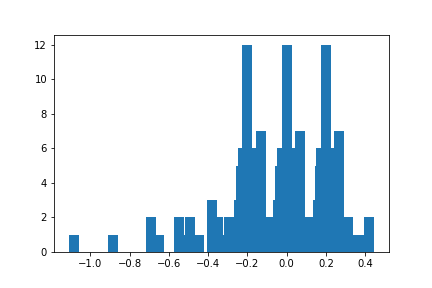

# **Behavioral Cloning** 

## Writeup

---

## Behavioral Cloning Project

In this project, not only do we learn about building and training a deep nueral network but we this project also focuses on data collection and data preprocessing.  However, the project seems to be focused more on collecting preprocessing the data to ensure that the data being trained is good so the model learns better.

The goals / steps of this project are the following:
* Use the simulator to collect data of good driving behavior
* Build, a convolution neural network in Keras that predicts steering angles from images
* Train and validate the model with a training and validation set
* Test that the model successfully drives around track one without leaving the road  

## Rubric Points
### Here I will consider the [rubric points](https://review.udacity.com/#!/rubrics/432/view) individually and describe how I addressed each point in my implementation.  

---
### Files Submitted & Code Quality

#### 1. Submission includes all required files and can be used to run the simulator in autonomous mode

My project includes the following files:
* model.py containing the script to create and train the model
* drive.py for driving the car in autonomous mode
* model.h5 containing a trained convolution neural network 
* writeup_report.md summarizing the results

#### 2. Submission includes functional code
Using the Udacity provided simulator and my drive.py file, the car can be driven autonomously around the track by executing 
```sh
python drive.py model.h5
```

### Model Architecture and Training Strategy

#### 1. Solution Design Approach

To tackle this project there are a few things that need to be considered:

1. The deep nueral network to use
2. The data that needs to collected
3. Preprocessing the data
4. Hyperparameter optimization

#### 1. Network

To start off, the network that was selected was the [NVIDIA deep nueral network](https://developer.nvidia.com/blog/deep-learning-self-driving-cars/).  I selected this because it is a simple yet powerful nueral network where I do not have to use a really powerful graphics card to train on.  Also it is easier to implement when compared to other models.


#### 2. Data Collected  

After choosing the model, I needed to collect the data or image from the simulator in order for me to train the model.  The simulator already provides the necessary information when we click on 'record' from the simulator.  The simulator will collect all images taken from the front, left and right camera along with the steering angle of the car for the corresponding images.


#### 3. Data processing

Furthermore, after collecting the data, it is shown that the data is mostly centered near 0, so to eliminate biases and avoid overfitting/underfitting the model, 3 things will be done.  First, we will generate data for including duplictes of images that have steering that is less than 1 standard deviation away from the mean.  Then, all images will be flipped as to add more data for training.  Lastly, since the dataset is mostly going to be skewed, I have added a function to **UP** sample my data and generate a less skewed data.

<center>
    
Skewed Data          |  Unskewed Data
:-------------------------:|:-------------------------:
  |  
    
</center>

Unlike the [NVIDIA paper](https://developer.nvidia.com/blog/deep-learning-self-driving-cars/), I chose to stick with RGB colors instead.  Additionally these will be passed into a generator where the images will go through data augmentation with `rotation_range = 5`,`channel_shift_range = 20` and a preprocessing function `random_brightness()` to either drking the image or to make it brighters.

#### 4. Final Model Architecture

The snippet below shows the final model architecture with an Adam Optimizer of 1e-4, 60 EPOCHS and Batch size of 128.

Also `BatchNormalization()` to normalize all the data before including passing it through the network.

```python
model = Sequential()
model.add(Lambda(lambda x: x/255 - 0.5, input_shape = (66,200,3)))
model.add(Conv2D(24, (5, 5), strides = (2,2), activation = "elu", kernel_regularizer = l2(.0001)))
model.add(Conv2D(36, (5, 5), strides = (2,2), activation = "elu", kernel_regularizer = l2(.0001)))
model.add(Conv2D(48, (3, 3), activation = "elu", kernel_regularizer = l2(.0001)))
model.add(Conv2D(64, (3, 3), activation = "elu", kernel_regularizer = l2(.0001)))
model.add(Conv2D(64, (3, 3), activation = "elu", kernel_regularizer = l2(.0001)))
model.add(Flatten())
model.add(Dense(100, kernel_regularizer = l2(.0001), activation = 'elu'))
model.add(Dense(25,  kernel_regularizer = l2(.0001), activation = 'elu'))
model.add(Dense(10, kernel_regularizer = l2(.0001), activation = "elu"))
model.add(Dense(1))

model.compile(optimizer = Adam(lr = 0.0001), loss='mse')
model.fit_generator(datagen.flow(X_train,y_train, batch_size = batch, shuffle = True),
                    steps_per_epoch = 2000, 
                    validation_data = (X_valid,y_valid), 
                    validation_steps = 800, 
                    epochs = 30, verbose =1,
                    callbacks = [EarlyStopping(patience = 2)])

```

### Results

I was able to produce 3 working models.  The first model `model1.h5` runs the best and this was achieved on a simpler model in when I ran it in the Udacity Workspace.  I however, was not able to remember the model used so I decieded to generate another 1.

`model9.h5` was able to complete the track but was not able to complete the track when I ran it with a video.  Hence, I had to trian again with a better model and I was able to complete the track with `model.h5`.

The first working model's video is labelled as `run1.mp4` while the NVIDIA model is named as `run2.mp4`.  We can see that both models work but the latter will oscillate a lot more than the former.

### Reflection

As for this project, I have spent countless nights building the model.  The hardest part was not the model itself but the data.  Great data needs to be collected and this took a great deal of time.  At first I was running the simulator to record the test run at max throttle.  Later I found to using a low speed to stay close to the cetner as possible.  This took more time but was very much worth it.

There are many methods to preprocessing the image.  I chose to crop out the parts which are not part of the lane and then resize them to (66,200) to train the model faster.  However, I stuck with the RGB color space rather than YUV color space.  Also, made the data less skewed in order to remove all biasis in the model.  Lastly, I augmented to images with `ImageDataGenerator()` in order to increase the robustness of the model.

In conclusion, the results were amazing and I was able to complete a lap around the track shown in `run2.mp4`.  
Youtube video link: https://youtu.be/6ZamldnT3aE
